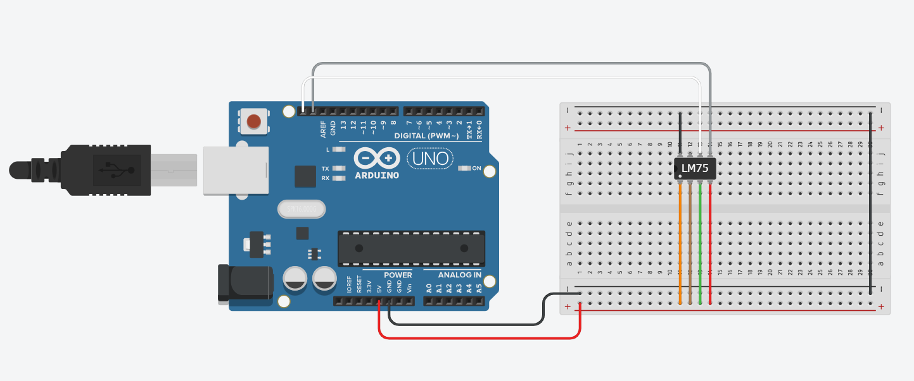

# Temperatursensor mit Arduino und LM75
Gruppe: Kevin, Kotaro, Sophia & Marius
## Inhalt
1. [Beschreibung](#beschreibung)
2. [Hardware](#hardware)
3. [Schaltplan](#schaltplan)
    1. [Pin Konfiguration](#pin-konfiguration)
4. [Arduino Code](#arduino-code)

## Beschreibung
Das Projekt zeigt, wie man einen LM75 Temperatursensor mit einem Arduino verbindet und ausliest. Der LM75 ist ein digitaler Temperatursensor, der über die I2C-Schnittstelle kommuniziert.

Der LM75 Temperatursensor misst die Temperatur und gibt sie digital über die I2C-Schnittstelle aus. Die Kommunikation erfolgt über zwei Leitungen, SDA (Serial Data) und SCL (Serial Clock), die es dem Arduino ermöglichen, mit dem Sensor zu kommunizieren.

Die I2C-Kommunikation ermöglicht es dem Arduino, mehrere Geräte über denselben Datenbus anzuschließen und mit ihnen zu kommunizieren.

Diese Verbindung ermöglicht es dem Arduino, die Temperaturdaten vom LM75 abzurufen und zu verarbeiten.

## Hardware
- Arduino Uno
- LM75 Temperatursensor
- Verbindungskabel
- Steckbrett

## Schaltplan

### Pin Konfiguration


## Arduino Code
```cpp
#include <Wire.h>

#define LM75 0x4F

void setup() {
  Serial.begin(9600);
  Wire.begin();
}

void loop() {
  // Temperaturdaten anfragen
  Wire.beginTransmission(LM75);
  Wire.endTransmission();
  
  // 2 Bytes von Temperaturdaten lesen
  Wire.requestFrom(LM75, 2);
  if(Wire.available() >= 2) { // Verfügbarkeit von 2 Bytes zum Auslesen prüfen
    byte c1 = Wire.read(); // erster byte
    byte c2 = Wire.read(); // zweiter byte
    
    // Beide Bytes in einen 16-bit integer kombinieren
    int16_t temp_raw = c1 * 256 + c2;
    
    // In Celsius konvertieren
    float temperatur = temp_raw / 256.0; 
    
    Serial.print("Temperature: ");
    Serial.print(temperatur);
    Serial.println(" °C");
  }
  
  delay(1000);
}
```

## Quellen
- [Ardiono I2C Protokoll](https://docs.arduino.cc/learn/communication/wire/)
- [Arduino Wire Bibliothek](https://www.arduino.cc/reference/en/language/functions/communication/wire/)
- [Datenblatt LM75](https://www.analog.com/media/en/technical-documentation/data-sheets/lm75.pdf)